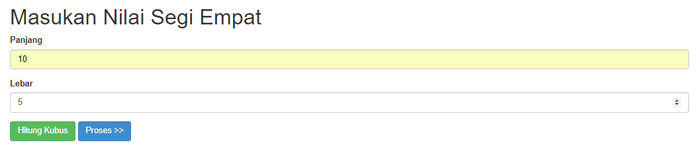
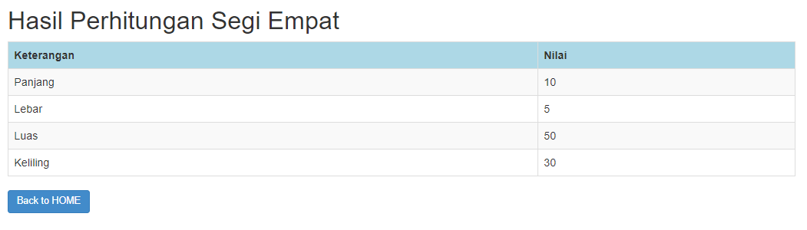
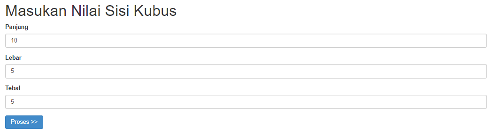
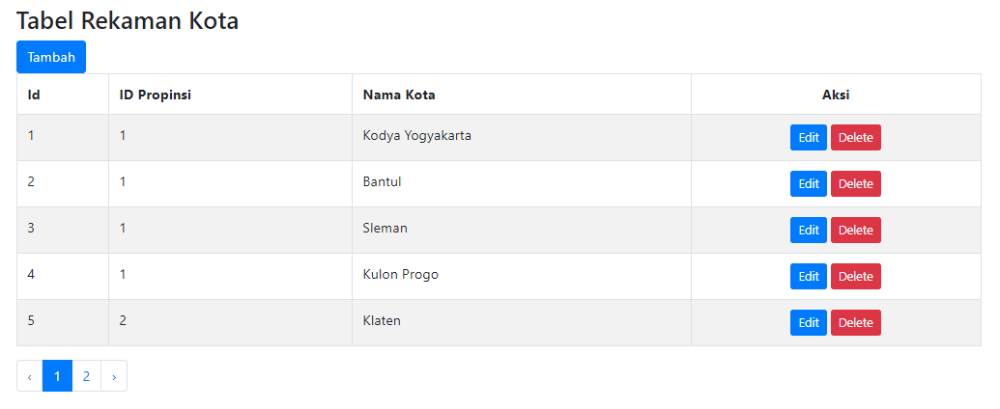
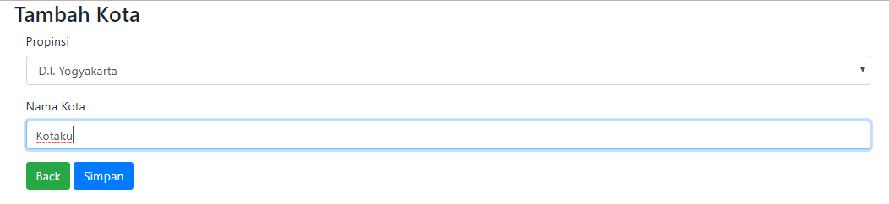
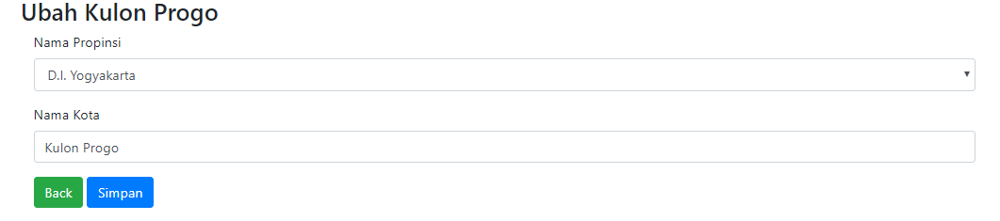
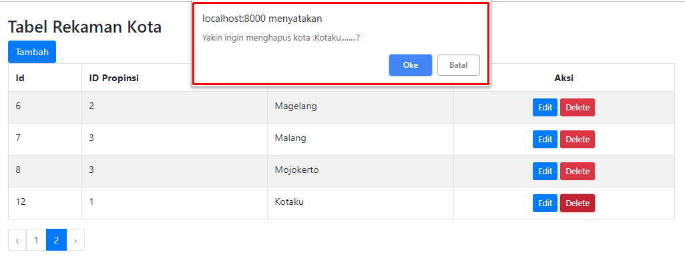

## License

The Laravel framework is open-sourced software licensed under the [MIT license](https://opensource.org/licenses/MIT).

  

# Pertemuan 1

## Pengenalan Laravel
* Overview PHP OOP
* Instalasi dan Konfigurasi

  

# Pertemuan 2

* Membuat Model (SegiEmpat dan Kubus)
* Membuat Controller (SegiEmpatController)
* Membuat View ([hasil.blade], [hasilKubus.blade], [inputKubus.blade], [inputSegiEmpat.blade])

## Output :
* inputSegiEmpat.blade
  
* hasil.blade
  
* inputKubus.blade
  
* hasilKubus.blade
  
  

# Pertemuan 3

* Membuat Model (Kota dan Provinsi)
* Membuat Controller (namaController)
* Membuat View ([index.blade], [create.blade], [edit.blade], [show.blade])

## Output :
* index.blade
  
* create.blade
  
* edit.blade
  
* delete ("Konfirmasi Hapus")
  